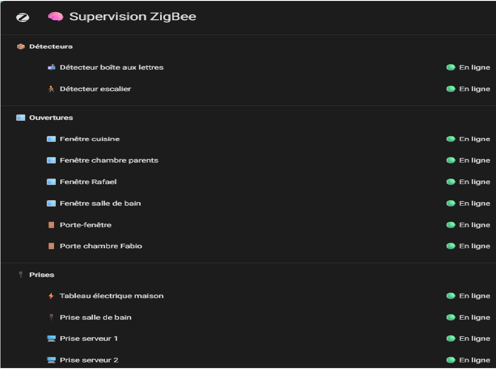
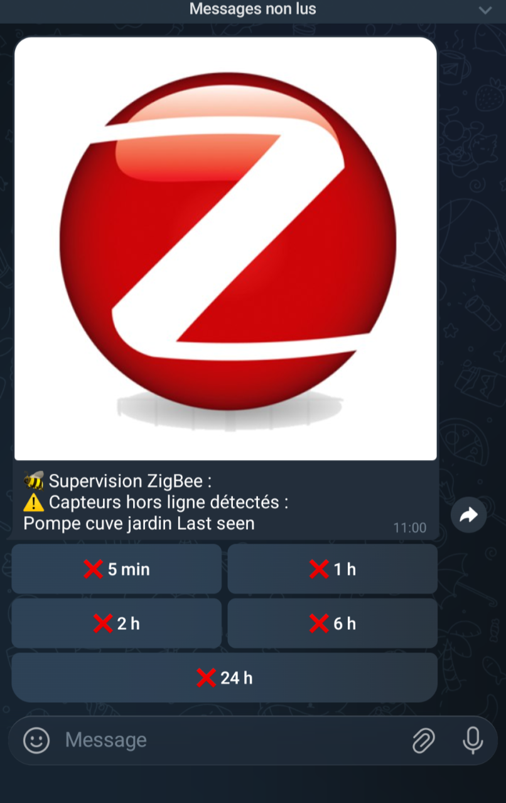
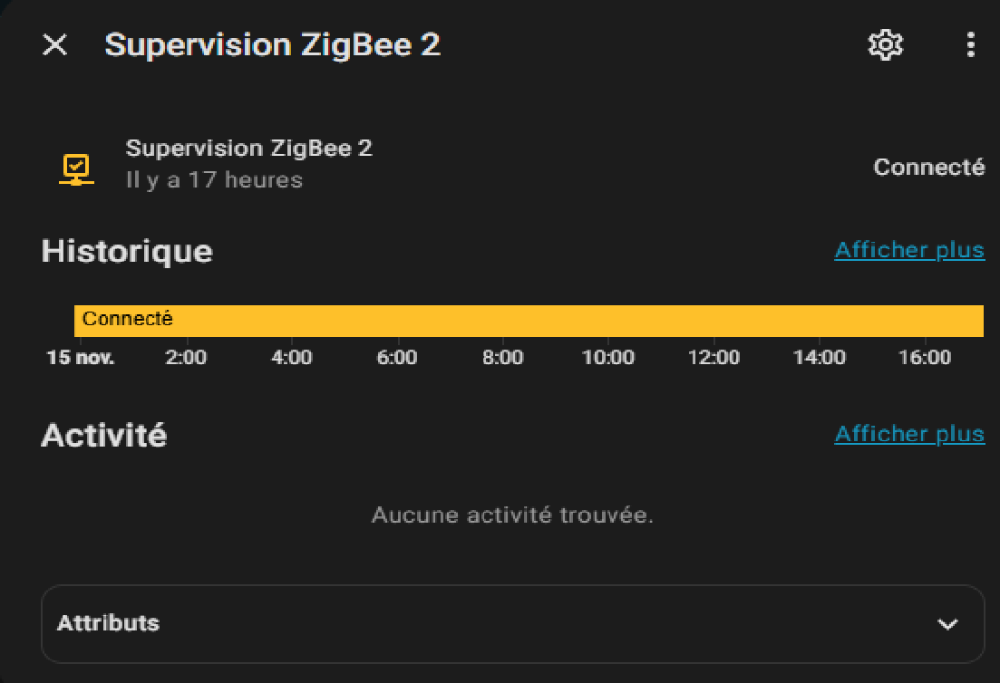

# 🐝 Supervision ZigBee – Home Assistant  
Surveillez l’état complet de votre réseau ZigBee sous Home Assistant grâce à une supervision avancée basée sur `last_seen`.

Ce projet inclut :
- 🔍 Détection automatique des capteurs ZigBee hors ligne  
- ⏱ Vérification toutes les 15 minutes  
- 📸 Alerte Telegram avec image + boutons interactifs  
- 🔁 Désactivation temporaire via Telegram  
- 🧩 Capteur global “tout ZigBee OK / KO”  
- 🖼️ Vue Lovelace complète organisée par catégories  
- 🟩 YAML simple, commenté et facile à adapter  

⚠️ **Toutes les entités présentes dans les fichiers YAML sont des exemples et doivent être adaptées à votre installation.**

---

# 📁 Structure du dépôt

supervision-zigbee-homeassistant/
├── README.md
├── LICENSE
├── SECRETS_EXAMPLE.yaml
├── images/
│   ├── tableau-de-bord.png
│   ├── telegram.png
│   └── CV.png
├── homeassistant/
    ├── template/
    │   └── supervision_zigbee.yaml
    ├── input_boolean/
    │   └── supervision_zigbee.yaml
    ├── automations/
    │   ├── zigbee_alert.yaml
    │   └── zigbee_disable_buttons.yaml
    ├── dashboards/
    │   └── zigbee_view.yaml
    └── entities/
        └── binary_sensor_supervision_zigbee.yaml


---

# 🧠 Fonctionnement général

### ✔ 1. Capteur global ZigBee
Un `binary_sensor` calcule si **tous vos capteurs ZigBee** ont un `last_seen` récent (`< 24h`).

- 🟢 **ON** = Tout est en ligne  
- 🔴 **OFF** = Un ou plusieurs capteurs ne communiquent plus  

La liste exacte des capteurs hors ligne est disponible dans l’attribut `hors_ligne`.

---

### ✔ 2. Alerte Telegram
Toutes les 15 minutes, Home Assistant vérifie :

- si un capteur est hors ligne  
- si la supervision ZigBee est activée (`input_boolean.supervision_zigbee_active`)

Si oui, une alerte Telegram est envoyée avec :
- une image  
- la liste des capteurs hors ligne  
- des boutons interactifs :

  - ❌ 5 min  
  - ❌ 1h  
  - ❌ 2h  
  - ❌ 6h  
  - ❌ 24h  

---

### ✔ 3. Désactivation temporaire via Telegram
En cliquant sur un bouton Telegram, la supervision se coupe pour la durée choisie.  
À la fin de la période, elle se réactive automatiquement et vous recevez une confirmation.

---

# 🔧 Installation

### 1️⃣ Copier les fichiers dans Home Assistant
Placez chaque fichier dans les répertoires correspondants, comme indiqué dans l’arborescence plus haut.

---

### 2️⃣ Adapter vos entités
Dans :

- `supervision_zigbee.yaml`
- `zigbee_view.yaml`

Remplacez les exemples :

sensor.capteur_1_last_seen
sensor.capteur_2_last_seen
sensor.fenetre_cuisine_last_seen


par vos entités **réelles**.

---

### 3️⃣ Configurer Telegram  
Ajoutez dans `secrets.yaml` :

telegram_bot_token: MON_BOT_TOKEN
telegram_chat_id: MON_CHAT_ID


Assurez-vous que l’intégration Telegram est configurée dans Home Assistant.

---

### 4️⃣ Ajouter la vue dans Lovelace  
Importer le contenu de `dashboards/zigbee_view.yaml` :

Configuration → Tableaux de bord → Ajouter une vue → Mode YAML


Ou collez le code dans une vue existante.

---

### 5. Activer l’input_boolean

Le fichier suivant active/désactive la supervision ZigBee :

bash
Copier le code
homeassistant/input_boolean/supervision_zigbee.yaml
Copiez-le dans votre dossier input_boolean et redémarrez Home Assistant.

---

## 📸 Aperçu du tableau de bord ZigBee


## 📨 Notification Telegram


## 📄 Exemple de vue complète


---

# 🖼️ Exemple de vue (avec capteurs fictifs)

```yaml
title: 🧠 Supervision ZigBee
icon: mdi:zigbee
type: entities

entities:
  - type: section
    label: 📦 Détecteurs
  - type: custom:template-entity-row
    entity: sensor.detecteur_entree_last_seen
    name: 🚪 Détecteur entrée (EXEMPLE)
    state: >
      
      
        🟢 En ligne
      
        🔴 Hors ligne
      

  - type: section
    label: 🪟 Ouvertures
  - type: custom:template-entity-row
    entity: sensor.fenetre_cuisine_last_seen
    name: 🪟 Fenêtre cuisine (EXEMPLE)
    state: >
      
      
        🟢 En ligne
      
        🔴 Hors ligne
      
(Voir le fichier complet dans dashboards/zigbee_view.yaml.)

🧩 Capteur résumé ZigBee (à ajouter dans Lovelace)

type: entity
entity: binary_sensor.supervision_zigbee_global
name: 🧠 ZigBee
icon: mdi:zigbee
state_color: true

📜 Licence
Projet sous licence MIT.
Vous êtes libre de le modifier, partager et l'intégrer à vos projets.

🤝 Contributions
Pull requests bienvenues.

Bonne utilisation ! 🐝🔥
N'hésitez pas à ⭐ le dépôt si cela vous aide 🙏
